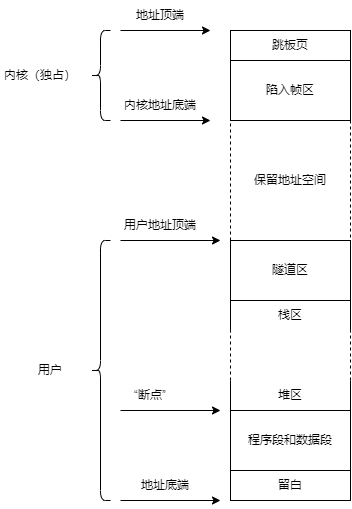

# 任务模型

任务是个抽象概念，在内核中并存在具体结构，但依附于两种具体结构而存在：进程和线程。

## 进程，独立的执行环境

是用户作业所需要的资源，代码等上下文的集合，作为统一体被内核管理。进程数据包括其内存空间，进程的所有权限，父子进程关系。

### 内存布局

进程的内存空间包含代码，数据，以及栈和堆等内存资源。这些资源存在于内存空间，但管理由另一种数据描述——内存布局，描述了程序各个段所在位置，栈的位置和分配状态，堆的位置和分配状态，共享内存的位置和状态。

### 权限

进程在创建其他进程时只能选择小于或等于父进程的权限进行继承。通过不同的权限集区分进程所属的级别，例如驱动程序拥有访问设备的能力。不同的权限通过系统调用中判断实现隔离。

## 线程，执行单元

进程参与调度但不具有执行上下文（PC，调用上下文），只有线程既是调度的主体又真正具有执行能力。
